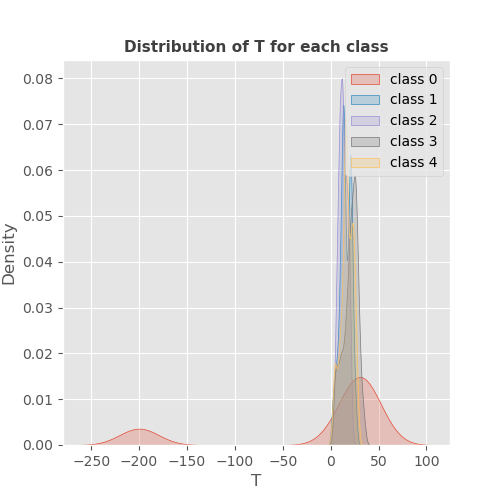
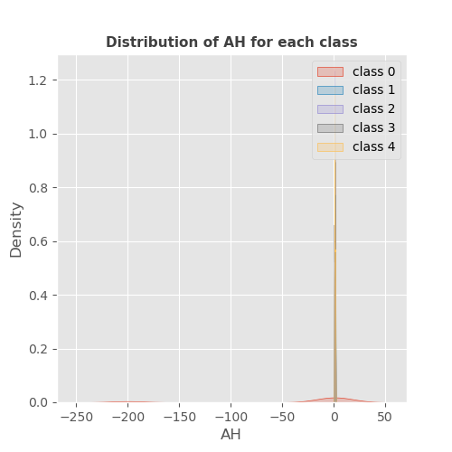
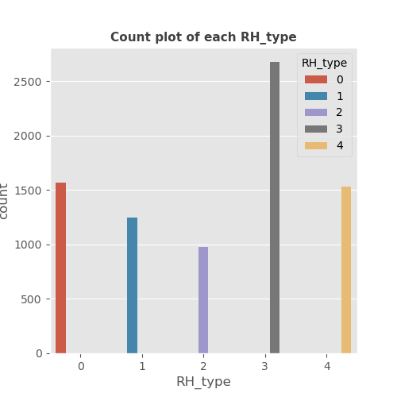
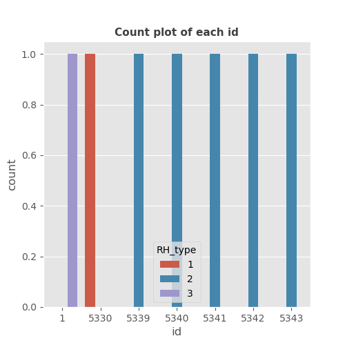
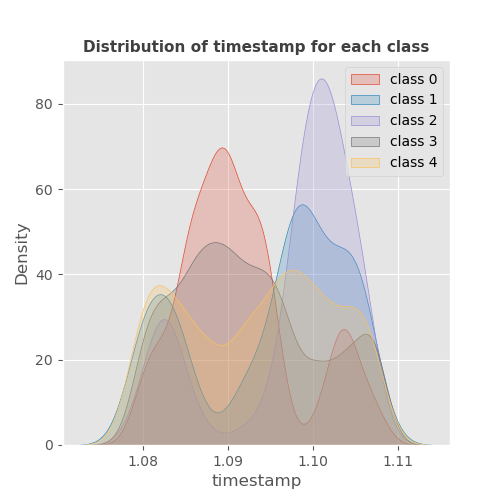
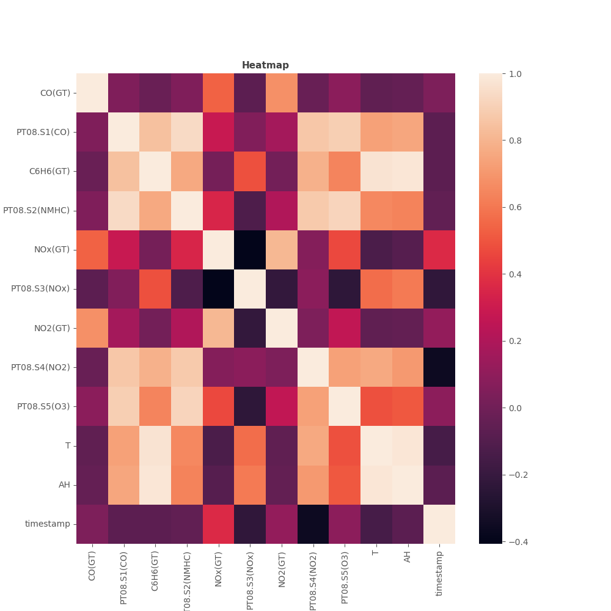

## Bivariate analysis of CO(GT) feature with target

_target.png)

------------------------------------------------------
## Bivariate analysis of PT08.S1(CO) feature with target

_target.png)

------------------------------------------------------
## Bivariate analysis of NMHC(GT) feature with target

_target.png)

------------------------------------------------------
## Bivariate analysis of C6H6(GT) feature with target

_target.png)

------------------------------------------------------
## Bivariate analysis of PT08.S2(NMHC) feature with target

_target.png)

------------------------------------------------------
## Bivariate analysis of NOx(GT) feature with target

_target.png)

------------------------------------------------------
## Bivariate analysis of PT08.S3(NOx) feature with target

_target.png)

------------------------------------------------------
## Bivariate analysis of NO2(GT) feature with target

_target.png)

------------------------------------------------------
## Bivariate analysis of PT08.S4(NO2) feature with target

_target.png)

------------------------------------------------------
## Bivariate analysis of PT08.S5(O3) feature with target

_target.png)

------------------------------------------------------
## Bivariate analysis of T feature with target

------------------------------------------------------
## Bivariate analysis of AH feature with target

------------------------------------------------------
## Bivariate analysis of RH_type feature with target

------------------------------------------------------
## Bivariate analysis of id feature with target

------------------------------------------------------
## Bivariate analysis of timestamp feature with target

------------------------------------------------------
## Heatmap

------------------------------------------------------
